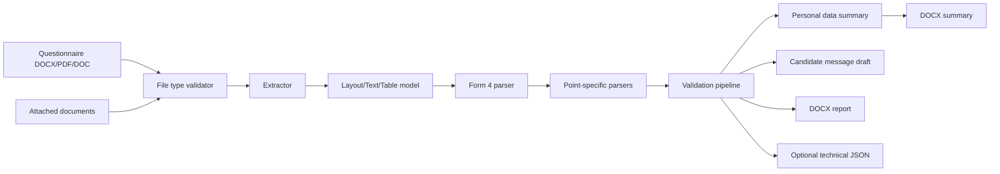

# Architecture

## Solution

```text
Form4Checker.sln

src/
  Form4Checker.App/
  Form4Checker.Core/
  Form4Checker.Extraction/
  Form4Checker.Reporting/
  Form4Checker.Security/
  Form4Checker.Packaging/

tests/
  Form4Checker.Core.Tests/
  Form4Checker.Extraction.Tests/
  Form4Checker.Reporting.Tests/
  Form4Checker.Security.Tests/
  Form4Checker.GoldenTests/
```

## Data Flow



## Projects

### Form4Checker.Core

Contains domain models, validation rules, deterministic validation pipeline, personal data summary model, and candidate message builder contracts.

### Form4Checker.Extraction

Reads DOCX through Open XML SDK, PDFs through a local text-layer extractor, and Word 97-2003 DOC through local deterministic Compound File/WordDocument extraction. Parses Form 4 sections and tables. Does not execute document content and does not use Office automation or LibreOffice conversion.

### Form4Checker.Reporting

Builds DOCX report and DOCX personal data summary through Open XML SDK.

### Form4Checker.Security

Provides file type validation, PII redaction, audit logging, secure temp folder cleanup, settings protection, and a network guard.

### Form4Checker.App

WPF shell, MVVM view models, file pickers, results list, settings window, and export commands.

### Form4Checker.Packaging

Inno Setup script and publishing profiles.

## Core Interfaces

- `IQuestionnaireExtractor`
- `IDocxQuestionnaireExtractor`
- `IPdfQuestionnaireExtractor`
- `IDocQuestionnaireExtractor`
- `IForm4SectionParser`
- `IForm4TableParser`
- `IValidationRule`
- `IValidationPipeline`
- `IPersonalDataSummaryBuilder`
- `ICandidateMessageBuilder`
- `IDocxReportBuilder`
- `IDocxPersonalDataSummaryBuilder`
- `ISecureTempFileService`
- `IPiiRedactor`
- `IAuditLogger`
- `ISettingsProtector`
- `IFileTypeValidator`
- `INetworkGuard`
- `IInstallerDiagnostics`

## Versioning

- Application version is displayed in report technical information.
- Rule version is read from `rules/form4.validation.yaml`.
- Template detection distinguishes 21-point primary templates and 20-point legacy-compatible templates.

## Extracted Document Model

Extraction services produce a document-level model with raw text, pages, paragraphs, tables, layout blocks when available, and warnings. Validation evidence can point to file type, page, point, table, row, cell, raw value, normalized value, confidence, and extraction reason. Existing UI/reporting keeps using `CandidateQuestionnaire`, with the richer extraction model attached for diagnostics and future parser improvements.
